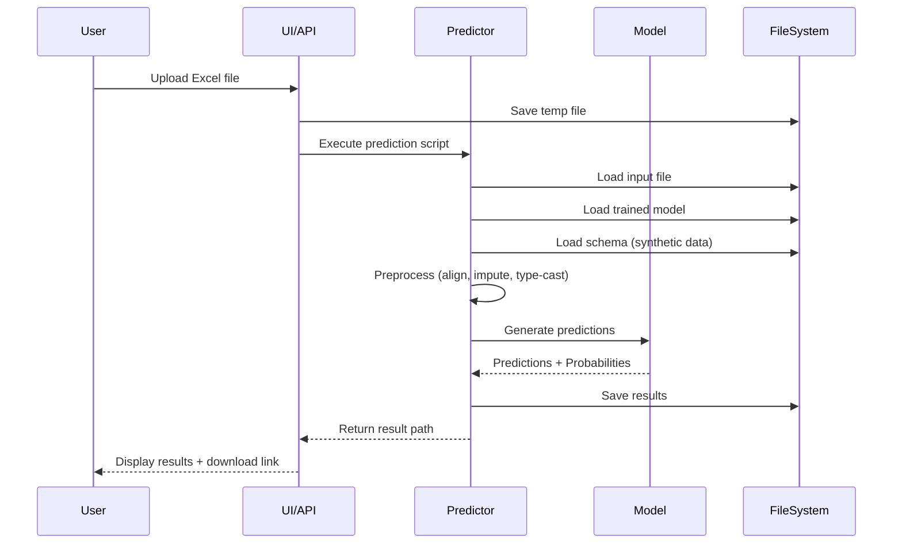

# Deal Win Probability Tool - Architecture Document

**Version:** 1.0  
**Last Updated:** December 2025  
**Status:** Production Ready

---

## Table of Contents

1. [Executive Summary](#executive-summary)
2. [System Overview](#system-overview)
3. [Architecture Principles](#architecture-principles)
4. [System Architecture](#system-architecture)
5. [Component Design](#component-design)
6. [Data Architecture](#data-architecture)
7. [Technology Stack](#technology-stack)
8. [Security Architecture](#security-architecture)
9. [Deployment Architecture](#deployment-architecture)
10. [Performance & Scalability](#performance--scalability)
11. [Monitoring & Observability](#monitoring--observability)
12. [Future Enhancements](#future-enhancements)

---

## 1. Executive Summary

### 1.1 Purpose
The Deal Win Probability Tool is an AI-powered system designed to predict the likelihood of winning business deals based on historical patterns and deal characteristics. It provides both interactive web interfaces and programmatic API access for integration with existing business systems.

### 1.2 Key Capabilities
- **Synthetic Data Generation**: Create realistic training datasets
- **Model Training**: Train XGBoost classifiers with automated feature engineering
- **Prediction**: Real-time deal outcome predictions with probability scores
- **Audit Trail**: Historical tracking of all predictions made
- **Dual Interface**: Streamlit UI for business users, FastAPI for system integration

### 1.3 Target Users
- **Business Analysts**: Interactive prediction and analysis
- **Sales Teams**: Deal assessment and prioritization
- **Data Scientists**: Model training and evaluation
- **System Integrators**: API-based automation

---

## 2. System Overview

### 2.1 High-Level Architecture

```
┌─────────────────────────────────────────────────────────────────┐
│                        Presentation Layer                        │
├──────────────────────────┬──────────────────────────────────────┤
│   Streamlit Web UI       │         FastAPI REST API             │
│   (Interactive)          │         (Programmatic)               │
└──────────────┬───────────┴──────────────┬───────────────────────┘
               │                          │
               └──────────┬───────────────┘
                          │
┌─────────────────────────▼─────────────────────────────────────┐
│                    Application Layer                          │
├───────────────┬─────────────────┬─────────────────────────────┤
│ Data          │ Model           │ Prediction                  │
│ Generator     │ Trainer         │ Engine                      │
└───────┬───────┴────────┬────────┴──────────┬──────────────────┘
        │                │                   │
┌───────▼────────────────▼───────────────────▼──────────────────┐
│                     Data Layer                                 │
├────────────────────┬──────────────────────────────────────────┤
│  Synthetic Data    │  Input/Output Files  │  Trained Models   │
│  (Training)        │  (Excel)             │  (Pickle)         │
└────────────────────┴──────────────────────────────────────────┘
```

### 2.2 System Context Diagram

The system operates as a standalone application with the following external interactions:

- **Users**: Access via web browser (Streamlit) or HTTP clients (API)
- **File System**: Reads input Excel files, writes predictions
- **Model Storage**: Persists trained models and encoders

---

## 3. Architecture Principles

### 3.1 Design Principles

1. **Separation of Concerns**
   - Clear boundaries between presentation, business logic, and data layers
   - Independent components that can be developed and tested separately

2. **Modularity**
   - Core logic implemented as standalone Python scripts
   - Reusable across both UI and API interfaces

3. **Statelessness**
   - No session state in API layer
   - File-based persistence for models and data

4. **Fail-Fast**
   - Early validation of inputs
   - Comprehensive error handling and logging

5. **Schema-Driven Processing**
   - Type enforcement based on training data schema
   - Robust handling of missing or malformed data

### 3.2 Technology Choices

| Component | Technology | Rationale |
|-----------|-----------|-----------|
| ML Framework | XGBoost | High performance, handles mixed data types, interpretable |
| Web UI | Streamlit | Rapid development, Python-native, no frontend code needed |
| API Framework | FastAPI | Modern, async, automatic API documentation, type validation |
| Data Format | Excel (XLSX) | Business-friendly, widely supported, preserves formatting |
| Model Serialization | Joblib/Pickle | Standard Python serialization, efficient for sklearn pipelines |

---

## 4. System Architecture

### 4.1 Layered Architecture

#### 4.1.1 Presentation Layer

**Streamlit UI (`app.py`)**
- **Responsibilities**:
  - User authentication and session management
  - Interactive forms for data upload and parameter selection
  - Real-time visualization of predictions and metrics
  - Audit trail dashboard with historical analytics
  
- **Key Features**:
  - Multi-page navigation (Home, Data Gen, Training, Predictions, Audit Trail)
  - File upload/download capabilities
  - Interactive charts using Plotly
  - Progress indicators for long-running operations

**FastAPI Backend (`api.py`)**
- **Responsibilities**:
  - RESTful API endpoints for all core operations
  - Request validation using Pydantic models
  - Automatic OpenAPI documentation
  - Health check endpoints for monitoring

- **Endpoints**:
  ```
  GET  /health                    - System health check
  POST /generate-synthetic-data   - Generate training data
  POST /train-model               - Train XGBoost classifier
  POST /predict                   - Make predictions on uploaded file
  ```

#### 4.1.2 Application Layer

**Data Generator (`src/generate_synthetic_data.py`)**
- Generates realistic synthetic deal data
- Configurable number of records
- Balanced class distribution (Won/Lost/Aborted)
- Realistic correlations between features

**Model Trainer (`src/train_xgb_classifier.py`)**
- Loads synthetic data
- Performs feature engineering (OneHot/Ordinal encoding)
- Trains XGBoost pipeline with 500 estimators
- Generates validation metrics and SHAP explanations
- Saves model and label encoder

**Predictor (`src/predict_xgb_classifier.py`)**
- Loads trained model and encoder
- **Schema-based preprocessing**:
  - Aligns input columns with training schema
  - Fills missing columns with appropriate defaults
  - Enforces data types (numeric vs categorical)
  - Imputes missing values (median for numeric, "UNKNOWN" for categorical)
- Generates predictions with probability scores
- Saves results with timestamp

#### 4.1.3 Data Layer

**File System Organization**
```
project/
├── data/
│   ├── input/          # User-uploaded files for prediction
│   └── output/         # Generated data and prediction results
│       ├── synthetic_deals.xlsx
│       └── predictions_YYYYMMDD_HHMMSS.xlsx
├── models/
│   ├── xgb_classifier.pkl      # Trained XGBoost pipeline
│   └── label_encoder.pkl       # Label encoder for target variable
└── docs/
    └── architecture_diagrams/  # System diagrams
```

---

## 5. Component Design

### 5.1 Core Components

#### 5.1.1 Data Generator

**Purpose**: Create synthetic training data with realistic patterns

**Algorithm**:
```python
1. Define feature spaces (SBU, Deal Size, Type of Business, etc.)
2. Generate random samples with weighted probabilities
3. Apply business rules to create correlations:
   - Larger deals have higher win probability
   - Certain SBUs have better success rates
   - Primary factors influence outcomes
4. Balance class distribution (Won: 40%, Lost: 40%, Aborted: 20%)
5. Export to Excel with proper formatting
```

**Output Schema**:
- **Identifiers**: CRM ID, Opportunity Name, Account Name
- **Deal Characteristics**: SBU, Type of Business, Deal Size, Expected TCV
- **Factors**: Primary L1/L2, Secondary L1/L2, Tertiary L1/L2
- **Team**: Bid-Team size, Delivery Location
- **Target**: Deal Status (Won/Lost/Aborted)

#### 5.1.2 Model Trainer

**Purpose**: Train XGBoost classifier on synthetic data

**Pipeline Architecture**:
```
Input Data
    ↓
Drop Identifiers (CRM ID, Opportunity Name, etc.)
    ↓
Separate Numeric & Categorical Features
    ↓
ColumnTransformer:
    ├─ Numeric: Passthrough
    ├─ Low Cardinality (<= 10 unique): OneHotEncoder
    └─ High Cardinality (> 10 unique): OrdinalEncoder
    ↓
XGBoost Classifier:
    ├─ Objective: multi:softprob (3 classes)
    ├─ Estimators: 500
    ├─ Eval Metric: mlogloss
    └─ Random State: 42
    ↓
Trained Pipeline (saved to models/xgb_classifier.pkl)
```

**Training Process**:
1. Load synthetic data
2. Encode target labels (Won=0, Lost=1, Aborted=2)
3. Split data (80% train, 20% test, stratified)
4. Fit pipeline on training data
5. Evaluate on test data
6. Generate SHAP explanations (optional)
7. Save model and encoder

**Metrics Tracked**:
- Accuracy
- Precision (weighted)
- Recall (weighted)
- F1-score (weighted)
- Confusion Matrix
- Classification Report

#### 5.1.3 Predictor

**Purpose**: Generate predictions for new deal data

**Robust Preprocessing Logic**:
```python
# 1. Load schema from synthetic data
synthetic_df = pd.read_excel(SYNTHETIC_DATA_PATH)
expected_types = {col: dtype for col, dtype in synthetic_df.dtypes.items()}

# 2. Add missing columns with defaults
for col in expected_cols:
    if col not in input_df.columns:
        if expected_types[col] in ['int64', 'float64']:
            input_df[col] = 0.0  # Numeric default
        else:
            input_df[col] = "UNKNOWN"  # Categorical default

# 3. Enforce data types
for col in input_df.columns:
    if expected_types[col] in ['int64', 'float64']:
        input_df[col] = pd.to_numeric(input_df[col], errors='coerce')
    else:
        input_df[col] = input_df[col].astype(str)

# 4. Impute missing values
for col in numeric_cols:
    input_df[col] = input_df[col].fillna(input_df[col].median())

for col in categorical_cols:
    input_df[col] = input_df[col].fillna("UNKNOWN")
```

**Output Format**:
- Original input columns
- `Predicted Deal Status`: Won/Lost/Aborted
- `Probability_Won`: Probability of winning (0-1)
- `Probability_Lost`: Probability of losing (0-1)
- `Probability_Aborted`: Probability of abortion (0-1)

### 5.2 Component Interactions



---

## 6. Data Architecture

### 6.1 Data Flow

```
┌──────────────┐
│ User Input   │ (Excel file with deal data)
└──────┬───────┘
       │
       ▼
┌──────────────────────────────────────────┐
│ Validation & Preprocessing               │
│ • Schema alignment                       │
│ • Missing column handling                │
│ • Type enforcement                       │
│ • Missing value imputation               │
└──────┬───────────────────────────────────┘
       │
       ▼
┌──────────────────────────────────────────┐
│ Feature Engineering Pipeline             │
│ • OneHot encoding (low cardinality)      │
│ • Ordinal encoding (high cardinality)    │
│ • Numeric passthrough                    │
└──────┬───────────────────────────────────┘
       │
       ▼
┌──────────────────────────────────────────┐
│ XGBoost Model                            │
│ • Multi-class classification             │
│ • 500 decision trees                     │
│ • Probability calibration                │
└──────┬───────────────────────────────────┘
       │
       ▼
┌──────────────────────────────────────────┐
│ Predictions Output                       │
│ • Deal Status (Won/Lost/Aborted)         │
│ • Probability scores for each class      │
│ • Saved to timestamped Excel file        │
└──────────────────────────────────────────┘
```

### 6.2 Data Models

#### 6.2.1 Input Data Schema

| Column | Type | Description | Example |
|--------|------|-------------|---------|
| CRM ID | String | Unique deal identifier | "CRM-2024-001" |
| Opportunity Name | String | Deal name | "Enterprise Cloud Migration" |
| Account Name | String | Customer name | "Acme Corp" |
| SBU | Categorical | Strategic Business Unit | "Cloud Services" |
| Type of Business | Categorical | Deal type | "New Business" |
| Deal Size | Categorical | Size category | "Large" |
| Expected TCV | Numeric | Total Contract Value | 500000.0 |
| Primary Factor L1 | Categorical | Main factor category | "Technical" |
| Primary Factor L2 | Categorical | Specific factor | "Solution Fit" |
| Bid-Team size | Numeric | Team members | 5 |
| Delivery Location | Categorical | Service location | "Onsite" |

#### 6.2.2 Output Data Schema

Includes all input columns plus:

| Column | Type | Description | Range |
|--------|------|-------------|-------|
| Predicted Deal Status | Categorical | Predicted outcome | Won/Lost/Aborted |
| Probability_Won | Float | Win probability | 0.0 - 1.0 |
| Probability_Lost | Float | Loss probability | 0.0 - 1.0 |
| Probability_Aborted | Float | Abortion probability | 0.0 - 1.0 |

### 6.3 Data Persistence

**Storage Strategy**:
- **Models**: Serialized using Joblib (efficient for sklearn objects)
- **Data**: Excel format (XLSX) for business compatibility
- **Audit Trail**: Timestamped prediction files for historical tracking

**File Naming Convention**:
```
predictions_YYYYMMDD_HHMMSS.xlsx
Example: predictions_20251201_143022.xlsx
```

---

## 7. Technology Stack

### 7.1 Core Technologies

| Layer | Technology | Version | Purpose |
|-------|-----------|---------|---------|
| **ML Framework** | XGBoost | 2.0+ | Gradient boosting classifier |
| **Data Processing** | Pandas | 2.0+ | Data manipulation and analysis |
| **Numerical Computing** | NumPy | 1.24+ | Array operations and math |
| **ML Pipeline** | Scikit-learn | 1.3+ | Feature engineering and preprocessing |
| **Web UI** | Streamlit | 1.28+ | Interactive web application |
| **API Framework** | FastAPI | 0.104+ | RESTful API backend |
| **ASGI Server** | Uvicorn | 0.24+ | High-performance async server |
| **Visualization** | Plotly | 5.17+ | Interactive charts and graphs |
| **File I/O** | OpenPyXL | 3.1+ | Excel file reading/writing |

### 7.2 Development Tools

- **Language**: Python 3.11
- **Package Manager**: pip
- **Containerization**: Docker
- **Orchestration**: Docker Compose
- **Version Control**: Git

### 7.3 Deployment Options

1. **Local Development**: Direct Python execution
2. **Docker**: Containerized deployment
3. **Streamlit Cloud**: Free cloud hosting for UI
4. **Cloud Platforms**: AWS, GCP, Azure (via Docker)

---

## 8. Security Architecture

### 8.1 Security Considerations

#### 8.1.1 Data Security

**At Rest**:
- Model files stored in local filesystem
- No encryption by default (add if needed for production)
- Access controlled by OS-level permissions

**In Transit**:
- HTTP by default (HTTPS recommended for production)
- File uploads validated for type and size
- No sensitive data logged

#### 8.1.2 Input Validation

**File Upload**:
```python
# Validate file type
allowed_extensions = ['.xlsx', '.xls']
if not file.filename.endswith(tuple(allowed_extensions)):
    raise HTTPException(400, "Invalid file type")

# Validate file size (e.g., max 10MB)
if file.size > 10 * 1024 * 1024:
    raise HTTPException(413, "File too large")
```

**Data Validation**:
- Pydantic models enforce API request schemas
- Type checking for all inputs
- Sanitization of user-provided strings

#### 8.1.3 Error Handling

**Principle**: Never expose internal system details in error messages

```python
try:
    # Process prediction
    result = predict(data)
except Exception as e:
    logger.error(f"Prediction failed: {str(e)}")
    raise HTTPException(500, "Prediction failed. Please contact support.")
```

### 8.2 Authentication & Authorization

**Current State**: No authentication (suitable for internal tools)

**Production Recommendations**:
1. **Streamlit**: Use `streamlit-authenticator` library
2. **FastAPI**: Implement OAuth2 with JWT tokens
3. **API Keys**: For system-to-system integration

### 8.3 Compliance

**Data Privacy**:
- No PII (Personally Identifiable Information) in training data
- Synthetic data generation ensures privacy
- Prediction data controlled by user uploads

**Audit Trail**:
- All predictions logged with timestamps
- File-based audit trail in `data/output/`
- Retention policy: Manual cleanup (automated retention can be added)

---

## 9. Deployment Architecture

### 9.1 Deployment Options

#### 9.1.1 Local Development

```bash
# Install dependencies
pip install -r requirements.txt

# Run Streamlit UI
streamlit run app.py

# Run FastAPI (separate terminal)
python api.py
```

**Pros**: Simple, fast iteration
**Cons**: Not suitable for multi-user access

#### 9.1.2 Docker Deployment

```bash
# Build images
cd docker
docker-compose build

# Run containers
docker-compose up -d
```

**Architecture**:
```
┌─────────────────────────────────────────┐
│         Docker Host                     │
│  ┌───────────────┐  ┌────────────────┐ │
│  │ Streamlit     │  │ FastAPI        │ │
│  │ Container     │  │ Container      │ │
│  │ Port: 8501    │  │ Port: 8000     │ │
│  └───────┬───────┘  └────────┬───────┘ │
│          │                   │         │
│          └───────┬───────────┘         │
│                  │                     │
│          ┌───────▼────────┐            │
│          │ Shared Volumes │            │
│          │ • data/        │            │
│          │ • models/      │            │
│          └────────────────┘            │
└─────────────────────────────────────────┘
```

**Pros**: Isolated, reproducible, portable
**Cons**: Requires Docker installation

#### 9.1.3 Streamlit Community Cloud

```yaml
# .streamlit/config.toml
[server]
headless = true
port = 8501
enableCORS = false

# runtime.txt
python-3.11.5
```

**Deployment Steps**:
1. Push code to GitHub
2. Connect repository to Streamlit Cloud
3. Configure app.py as main file
4. Deploy

**Pros**: Free, managed, automatic HTTPS
**Cons**: Ephemeral storage, limited resources

#### 9.1.4 Cloud Platforms

**AWS Elastic Beanstalk**:
```bash
eb init -p docker deal-win-probability
eb create deal-win-env
```

**Google Cloud Run**:
```bash
gcloud run deploy --image gcr.io/PROJECT/deal-win-ui --port 8501
```

**Azure Container Instances**:
```bash
az container create --image REGISTRY/deal-win-ui --ports 8501
```

### 9.2 Infrastructure Requirements

| Component | CPU | Memory | Storage | Network |
|-----------|-----|--------|---------|---------|
| Streamlit UI | 1 core | 1 GB | 500 MB | 1 Mbps |
| FastAPI | 1 core | 1 GB | 500 MB | 1 Mbps |
| Models | - | - | 50 MB | - |
| Data (per 1000 records) | - | - | 5 MB | - |

**Scaling Considerations**:
- Stateless design allows horizontal scaling
- File-based storage limits concurrent writes
- Consider database for high-concurrency scenarios

---

## 10. Performance & Scalability

### 10.1 Performance Metrics

**Training**:
- Synthetic data generation: < 5 seconds for 100 records
- Model training: 10-30 seconds for 100 records
- SHAP explanation: 5-10 seconds (optional)

**Prediction**:
- Single record: < 100ms
- Batch (100 records): < 1 second
- Batch (1000 records): < 5 seconds

**UI Response**:
- Page load: < 2 seconds
- File upload: Depends on file size and network
- Prediction display: < 1 second after processing

### 10.2 Optimization Strategies

#### 10.2.1 Model Optimization

**Current**:
- XGBoost with 500 estimators
- Full pipeline serialization

**Optimizations**:
1. **Model Compression**: Use `model.save_model()` instead of pickle
2. **Feature Selection**: Remove low-importance features
3. **Quantization**: Reduce model precision for faster inference
4. **Caching**: Cache model in memory (already implemented)

#### 10.2.2 Data Processing

**Current**:
- Pandas DataFrame operations
- In-memory processing

**Optimizations**:
1. **Chunking**: Process large files in chunks
2. **Parallel Processing**: Use multiprocessing for batch predictions
3. **Vectorization**: Leverage NumPy for numerical operations

#### 10.2.3 API Performance

**Current**:
- Synchronous file processing
- Single-threaded execution

**Optimizations**:
1. **Async Processing**: Use FastAPI background tasks
2. **Queue System**: Implement Celery for long-running jobs
3. **Caching**: Redis for frequently accessed data

### 10.3 Scalability Patterns

#### 10.3.1 Horizontal Scaling

```
┌─────────────────────────────────────────────┐
│          Load Balancer (Nginx)              │
└────┬────────────┬────────────┬──────────────┘
     │            │            │
┌────▼─────┐ ┌───▼──────┐ ┌──▼───────┐
│ API      │ │ API      │ │ API      │
│ Instance │ │ Instance │ │ Instance │
│ 1        │ │ 2        │ │ 3        │
└────┬─────┘ └───┬──────┘ └──┬───────┘
     │           │           │
     └───────────┼───────────┘
                 │
         ┌───────▼────────┐
         │ Shared Storage │
         │ (NFS/S3)       │
         └────────────────┘
```

#### 10.3.2 Vertical Scaling

- Increase CPU cores for faster training
- Add memory for larger datasets
- Use GPU for XGBoost training (optional)

---

## 11. Monitoring & Observability

### 11.1 Logging Strategy

**Log Levels**:
- **ERROR**: System failures, exceptions
- **WARNING**: Degraded performance, missing data
- **INFO**: Normal operations, predictions made
- **DEBUG**: Detailed execution flow (development only)

**Log Format**:
```json
{
  "timestamp": "2025-12-01T10:30:00Z",
  "level": "INFO",
  "component": "predictor",
  "message": "Prediction completed",
  "metadata": {
    "records": 50,
    "duration_ms": 234,
    "output_file": "predictions_20251201_103000.xlsx"
  }
}
```

### 11.2 Health Checks

**API Health Endpoint** (`/health`):
```json
{
  "status": "healthy",
  "model_loaded": true,
  "synthetic_data_available": true,
  "timestamp": "2025-12-01T10:30:00Z"
}
```

**Docker Health Checks**:
```dockerfile
HEALTHCHECK --interval=30s --timeout=10s --retries=3 \
  CMD curl --fail http://localhost:8501/_stcore/health || exit 1
```

### 11.3 Metrics Collection

**Key Metrics**:
- **Throughput**: Predictions per second
- **Latency**: P50, P95, P99 response times
- **Error Rate**: Failed predictions / total predictions
- **Model Performance**: Accuracy, F1-score on validation data

**Tools** (recommended for production):
- **Prometheus**: Metrics collection
- **Grafana**: Visualization dashboards
- **ELK Stack**: Log aggregation and search

---

## 12. Future Enhancements

### 12.1 Short-Term (1-3 months)

1. **Database Integration**
   - Replace file-based storage with PostgreSQL
   - Enable concurrent access and better querying
   - Implement proper audit trail with user tracking

2. **Authentication & Authorization**
   - Add user login (OAuth2/SAML)
   - Role-based access control (Admin, Analyst, Viewer)
   - API key management for programmatic access

3. **Model Versioning**
   - Track multiple model versions
   - A/B testing capabilities
   - Rollback to previous versions

4. **Enhanced Monitoring**
   - Real-time performance dashboards
   - Automated alerting for failures
   - Model drift detection

### 12.2 Medium-Term (3-6 months)

1. **Advanced ML Features**
   - Hyperparameter tuning automation (Optuna/Ray Tune)
   - Ensemble models (XGBoost + LightGBM + CatBoost)
   - Feature importance tracking over time
   - Automated retraining pipeline

2. **Real-Time Predictions**
   - WebSocket support for live updates
   - Streaming predictions (Kafka integration)
   - Batch prediction scheduling

3. **Enhanced UI**
   - Custom dashboards per user
   - Export to multiple formats (PDF, CSV, JSON)
   - Collaborative features (comments, sharing)

4. **Integration Capabilities**
   - CRM system connectors (Salesforce, HubSpot)
   - Webhook notifications
   - Slack/Teams integration for alerts

### 12.3 Long-Term (6-12 months)

1. **Advanced Analytics**
   - What-if scenario analysis
   - Deal optimization recommendations
   - Trend analysis and forecasting
   - Competitive intelligence integration

2. **Multi-Tenancy**
   - Support for multiple organizations
   - Data isolation and security
   - Custom models per tenant

3. **Explainable AI**
   - Interactive SHAP visualizations
   - Natural language explanations
   - Counterfactual analysis ("What would change the outcome?")

4. **Mobile Support**
   - Progressive Web App (PWA)
   - Native mobile apps (iOS/Android)
   - Offline prediction capabilities

---

## Appendices

### Appendix A: API Reference

See `/docs` endpoint when FastAPI is running for full OpenAPI specification.

### Appendix B: Configuration Reference

**Environment Variables**:
```bash
# Model paths
MODEL_PATH=/app/models/xgb_classifier.pkl
ENCODER_PATH=/app/models/label_encoder.pkl

# Data paths
SYNTHETIC_DATA_PATH=/app/data/output/synthetic_deals.xlsx
OUTPUT_DIR=/app/data/output

# Server configuration
STREAMLIT_SERVER_PORT=8501
UVICORN_HOST=0.0.0.0
UVICORN_PORT=8000
```

### Appendix C: Troubleshooting Guide

**Common Issues**:

1. **Model not found**
   - Ensure training has been completed
   - Check `models/` directory exists
   - Verify file permissions

2. **Prediction fails with "UNKNOWN" error**
   - Ensure synthetic data exists (used for schema)
   - Check input file format matches expected schema
   - Review logs for specific error details

3. **Docker container won't start**
   - Check Docker daemon is running
   - Verify port 8501/8000 not in use
   - Review container logs: `docker logs <container_id>`

### Appendix D: Glossary

- **SBU**: Strategic Business Unit
- **TCV**: Total Contract Value
- **L1/L2**: Level 1/Level 2 categorization
- **SHAP**: SHapley Additive exPlanations
- **XGBoost**: eXtreme Gradient Boosting
- **OneHot Encoding**: Binary encoding for categorical variables
- **Ordinal Encoding**: Integer encoding for categorical variables

---

**Document Control**

| Version | Date | Author | Changes |
|---------|------|--------|---------|
| 1.0 | 2025-12-01 | System Architect | Initial comprehensive architecture document |

**Review & Approval**

| Role | Name | Date | Signature |
|------|------|------|-----------|
| Technical Lead | | | |
| Security Architect | | | |
| DevOps Lead | | | |
| Product Owner | | | |
