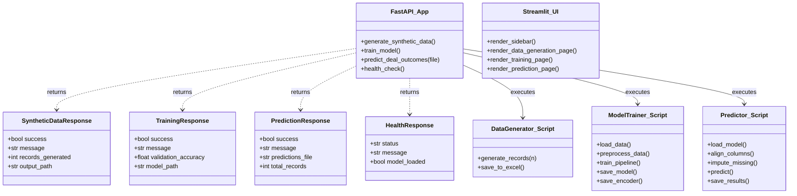
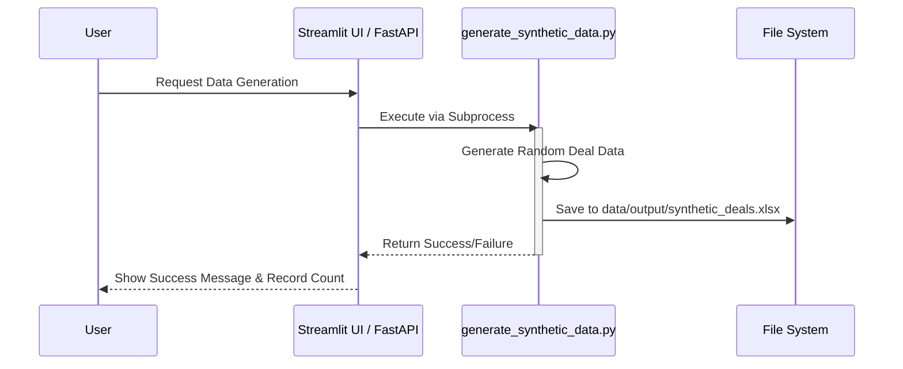
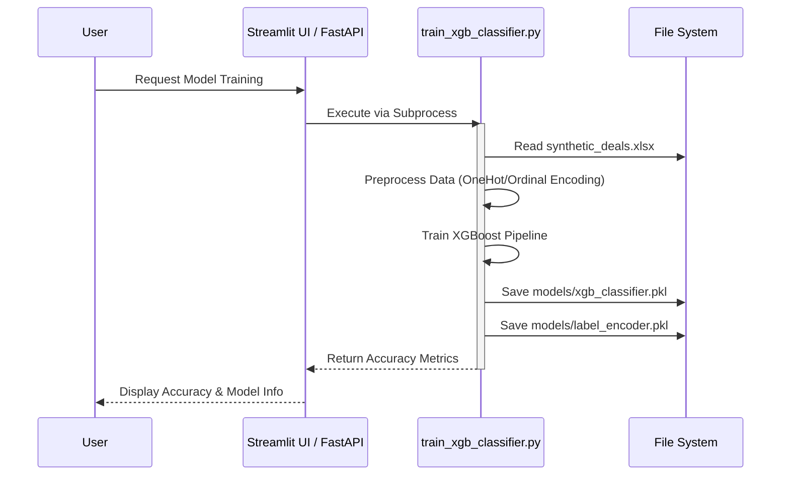
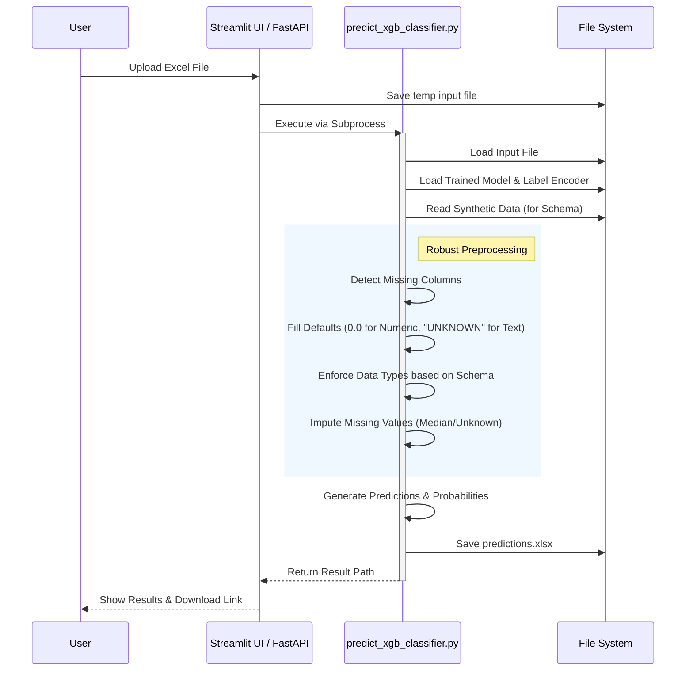

# System Architecture & Design

This document provides a detailed technical overview of the Deal Win Probability Tool, including high-level architecture, class structures, and interaction flows.

## 1. High-Level Architecture

The system follows a modular architecture with a clear separation between the User Interface, API Layer, Core Processing Logic, and Data/Model Storage.

```mermaid
graph TB
    subgraph "Frontend Layer"
        UI[Streamlit UI<br>(app.py)]
    end

    subgraph "API Layer"
        API[FastAPI Backend<br>(api.py)]
    end

    subgraph "Core Logic Layer"
        Gen[Data Generator<br>(src/generate_synthetic_data.py)]
        Train[Model Trainer<br>(src/train_xgb_classifier.py)]
        Pred[Predictor<br>(src/predict_xgb_classifier.py)]
    end

    subgraph "Storage Layer"
        subgraph "Data"
            Input[Input Data<br>(data/input/)]
            Output[Output Data<br>(data/output/)]
        end
        subgraph "Models"
            ModelFile[XGBoost Model<br>(models/xgb_classifier.pkl)]
            EncoderFile[Label Encoder<br>(models/label_encoder.pkl)]
        end
    end

    %% Interactions
    UI -->|Calls via Subprocess| Gen
    UI -->|Calls via Subprocess| Train
    UI -->|Calls via Subprocess| Pred
    
    API -->|Calls via Subprocess| Gen
    API -->|Calls via Subprocess| Train
    API -->|Calls via Subprocess| Pred

    Gen -->|Writes| Output
    Train -->|Reads| Output
    Train -->|Saves| ModelFile
    Train -->|Saves| EncoderFile
    
    Pred -->|Reads| Input
    Pred -->|Loads| ModelFile
    Pred -->|Loads| EncoderFile
    Pred -->|Writes| Output
```

## 2. Class Diagram

Although the core logic is implemented as functional scripts, the API layer uses Pydantic models for strict type validation. The diagram below represents the logical structure of the application components.



## 3. Sequence Diagrams

### 3.1 Data Generation Workflow
This flow illustrates how synthetic training data is created.



### 3.2 Model Training Workflow
This flow shows how the model is trained on the synthetic data.



### 3.3 Prediction Workflow
This flow demonstrates how the system handles new data for prediction, including the robust schema matching logic.


